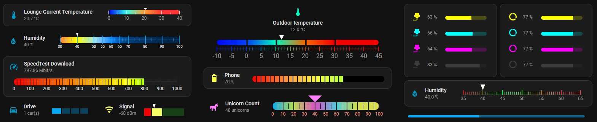
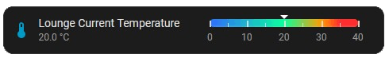
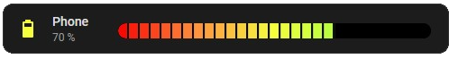
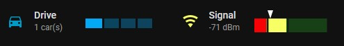
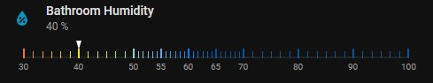
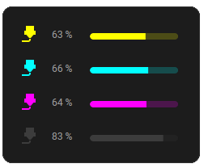
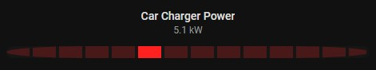

# Segment Gauge

A highly configurable tile-like linear gauge card with a built-in visual editor as well as full YAML support.
 


## Features

- Structured segment geometry (not just threshold colors)
- Gradient, stepped, and current-level bar color modes
- Fill and color snapping for segmented bars
- Integrated scale with configurable ticks, labels, and placement
- Dynamic icon and icon color behavior based on entity value
- Tile-like default layout
- Compact row variant for Entities cards
- Configure via the Home Assistant [visual editor](docs/gui.md) or [YAML](docs/configuration.md)

## Installation

### HACS (recommended)

1. Open HACS
2. Add this repository as a **Dashboard** (custom) repository
3. Install **Segment Gauge**
4. Refresh the browser
5. Add the Lovelace resource if HACS does not do it automatically

### Manual

1. Build or download `segment-gauge.js`
2. Copy it to:
   - `/config/www/community/segment-gauge/segment-gauge.js`
3. Add a Lovelace resource:

```yaml
resources:
  - url: /local/community/segment-gauge/segment-gauge.js
    type: module
```

## Examples
Try these cards and tweak with the UI.

### Basic Tile-Style Gradient Gauge
Smooth gradient bar with scale and pointer.



```yaml
type: custom:segment-gauge
entity: sensor.lounge_current_temperature     # Accepts any entity with a numeric value.
layout:
  mode: horizontal                            # Gauge placed to the right of icon/text.
  split_pct: 50                               # Horizontal % of card dedicated to icon and text .
data:                                         # Specify range, units and precision.
  min: 0
  max: 40
bar:
  height: 12                                  # Bar height in px.
  color_mode: gradient                        # Smooth gradient between colors of levels.
  track:
    intensity: 100                            # Visibility of the unfilled portion of the bar.
pointer:
  show: true
  color_mode: custom                          # Defaults to white.
  color: "#ffffff"
levels:                                       # Similar to other gauge cards.
  - value: 0
    color: "#0006f7"                         # Cold (blue)
    icon: null                                # Specify for dynamic icon.
  - value: 10
    color: "#33ffeb"
  - value: 20
    color: "#ff9e33"
  - value: 30
    color: "#ff3333"                         # Hot (red)
scale:
  show: true
  placement: bottom                           # Scale placed over the bottom of the bar.
  ticks:
    height_major: 10                          # Height in px.
    height_minor: 5                           # Height in px.
    minor_per_major: 1                        # Number of minor ticks between major ticks.
  labels:
    precision: 0                              # Overrides data.precision for labels.
    color_mode: theme                         # Label color defaults to theme default.
actions:                                      # Actions configured like standard cards.
  tap_action:
    action: more-info
```

### Fixed-Segment Quantized Gauge
Fixed-width segments with snapped fill and level-based coloring. Battery / Graphic EQ style.



```yaml
type: custom:segment-gauge
entity: sensor.iphone_battery_level   # Numeric entity (0-100)
content:
  name: Phone                         # Override display name
  icon_color:
    mode: level                       # Icon color follows defined levels
layout:
  mode: horizontal                    # Bar to the right of icon/text
  split_pct: 15                       # Small text column, wide bar
style:
  card: default
data:
  min: 0
  max: 100                            # Battery percentage range
levels:                               # Color progression
  - value: 0
    color: "#f70000"                  # Critical (red)
  - value: 25
    color: "#ff8f3e"
  - value: 50
    color: "#f5ff3e"
  - value: 75
    color: "#a4ff3e"
  - value: 100
    color: "#43ff3e"                  # Full (green)
bar:
  height: 17                          # Taller bar for visual weight
  edge: rounded
  color_mode: gradient                # Gradient between level colors
  fill_mode: cumulative               # Fill from start to current value
  track:
    background: "#000000"
    intensity: 0                      # Bar invisible on track
  segments:
    mode: fixed
    width: 12                         # Segment width in px
    gap: 2                            # Gap between segments
  snapping:
    fill: nearest                     # Fill snaps to nearest segment
    color: midpoint                   # Each segment a single sampled color
pointer:
  show: false                         # Clean battery-style bar (no pointer)
scale:
  show: false                         # No tick marks or labels
```

### Compact Gauges
1. Small range counter and capacity indicator
2. Level-based segments with upwards fill-snapping, emphasising threshold ranges rather than exact values



```yaml
type: custom:segment-gauge
entity: sensor.drive_car_count
content:
  name: Drive                         # Override display name
  icon: mdi:car-multiple              # Default shows multiple cars
layout:
  mode: horizontal
  split_pct: 38
style:
  card: plain                         # Borderless
data:
  min: 0
  max: 4
  unit: car(s)                        # Add unit
levels:                               # All levels the same color
  - value: 0
    color: "#03a9f4"
    icon: mdi:car-off                 # 0 cars = car-off icon
  - value: 1
    color: "#03a9f4"
    icon: mdi:car                     # 1 car = car icon. 2, 3 and 4 default to car-multiple
  - value: 2
    color: "#0ca5eb"
  - value: 3
    color: "#0ca4eb"
  - value: 4
    color: "#0ca3eb"
bar:
  height: 14
  edge: square                        # Square edge - this is a counter card
  color_mode: stepped
  track:
    background: "#0f0f0f"
    intensity: 35                     # Slightly visible track to indicate finite slots
  segments:
    mode: level                       # Segments spaced according to levels
    gap: 3
  snapping:
    fill: nearest                     # Cannot have fractional cars
pointer:
  show: false                         # No need for pointer. The count is obvious
grid_options:                         # Standard lovelace options for half width card
  columns: 6
  rows: auto
```

```yaml
type: custom:segment-gauge
entity: sensor.meter_bluetooth_signal
content:
  name: Signal                         # Override display name
  icon_color:
    mode: level                        # Icon color follows level
layout:
  mode: horizontal
  split_pct: 33
data:
  min: -90
  max: 0
levels:
  - value: -90
    color: "#f70006"
  - value: -75
    color: "#f8ff64"
  - value: -50
    color: "#00ff00"
bar:
  height: 20
  edge: square
  color_mode: stepped
  fill_mode: current_segment          # Highlight only the active segment
  track:
    intensity: 16
  segments:
    mode: level                       # Segments are levels
    gap: 3
  snapping:
    fill: up                          # Completely fill current segment to indicate range
pointer:
  show: true
  size: 20
  angle: 45                           # A pointier pointer (Oh pointy pointy)
style:
  card: plain
grid_options:                         # Standard lovelace options for half width card
  columns: 6
  rows: auto
```

### Scale-Only Variable Segment Gauge
Variable-width levels rendered as a colored scale with pointer. No bar so scale is the primary visual.



```yaml
type: custom:segment-gauge
entity: input_number.bathroom_humidity
layout:
  mode: vertical                      # Vertical mode places gauge below icon and text.
  gauge_alignment: center_labels      # Margin equal either side of scale labels.
style:
  card: plain                         # No border
data:
  min: 30
  max: 100
levels:                               # Variable sized levels
  - value: 30
    color: "#ff8040"
  - value: 40
    color: "#ffff00"
  - value: 50
    color: "#a6e3e3"
  - value: 55
    color: "#66b3ff"
  - value: 60
    color: "#0f87ff"
  - value: 65
    color: "#0057ae"
  - value: 70
    color: "#0959aa"
  - value: 80
    color: "#0958aa"
  - value: 90
    color: "#0957aa"
bar:
  show: false                         # No bar
pointer:
  show: true                          # Anoint my scale. (Anointy-nointy)
  size: 16
  angle: 37
  y_offset: -4                        # Adjust vertical position
scale:
  show: true
  placement: bottom                   # Major/minor ticks aligned at the bottom
  y_offset: 15                        # Adjust vertical position
  spacing: levels
  ticks:
    color_mode: gradient              # Scale itself has smooth color gradient
    minor_per_major: 5
    height_major: 11
  labels:
    size: 10                          # Smaller labels for compactness
```

### Segment Gauge Row for Entities Card
Inline, compact row gauge designed for dense status lists in the Home Assistant entities card. This card is YAML only.



```yaml
type: entities                                    
entities:
  - type: custom:segment-gauge-row
    entity: sensor.printer_yellow_toner_remaining
    content:
      show_name: false
      icon_color:
        mode: level
    layout:
      mode: horizontal
      split_pct: 24
    style:
      card: plain
    bar:
      track:
        intensity: 21
    pointer:
      show: false
    scale:
      show: false
    levels:
      - value: 0
        color: yellow
  - type: custom:segment-gauge-row
    entity: sensor.printer_cyan_toner_remaining
    content:
      show_name: false
      icon_color:
        mode: level
    layout:
      mode: horizontal
      split_pct: 24
    style:
      card: plain
    bar:
      track:
        intensity: 21
    pointer:
      show: false
    scale:
      show: false
    levels:
      - value: 0
        color: cyan
  - type: custom:segment-gauge-row
    entity: sensor.printer_magenta_toner_remaining
    content:
      show_name: false
      icon_color:
        mode: level
    layout:
      mode: horizontal
      split_pct: 24
    style:
      card: plain
    bar:
      track:
        intensity: 21
    pointer:
      show: false
    scale:
      show: false
    levels:
      - value: 0
        color: magenta
  - type: custom:segment-gauge-row
    entity: sensor.printer_black_toner_remaining
    content:
      show_name: false
      icon_color:
        mode: level
    layout:
      mode: horizontal
      split_pct: 24
    style:
      card: plain
    bar:
      track:
        intensity: 21
    pointer:
      show: false
    scale:
      show: false
    levels:
      - value: 0
        color: "#3c3c3c"
grid_options:
  columns: 6
```

### Fixed-Width Segment Gauge with a Single Active Segment
Stacked visual indicator with only the current segment filled. Useful for quick visual indication of the state of all sorts of kitt.



```yaml
type: custom:segment-gauge
entity: sensor.car_charger_power_kw
content:
  name: Car Charger Power
  show_icon: false
  show_name: true
  show_state: true
  icon_color:
    mode: theme
style:
  card: plain
layout:
  mode: stacked
  gauge_alignment: center_labels
data:
  min: 0
  max: 12
levels:
  - value: 0
    color: "#ff2020"
bar:
  height: 15
  edge: rounded
  radius: 100                         # High radius for a pointier bar
  color_mode: current_level
  fill_mode: current_segment          # Fill current segment only
  track:
    background: "#161616"
    intensity: 22
  segments:
    mode: fixed
    width: 33
    gap: 4
  snapping:
    fill: up
    color: "off"
pointer:
  show: false
  color_mode: custom
  color: "#ffffff"
scale:
  placement: below
  spacing: even
actions:
  tap_action:
    action: none
  hold_action:
    action: none
  double_tap_action:
    action: none
```
