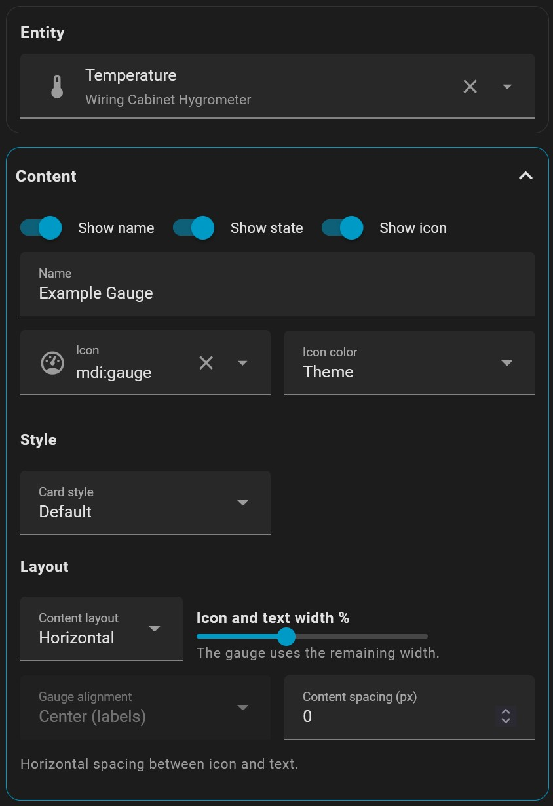
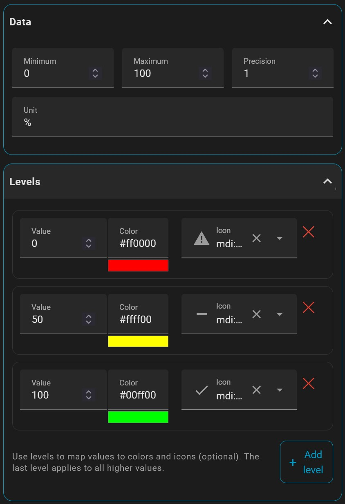
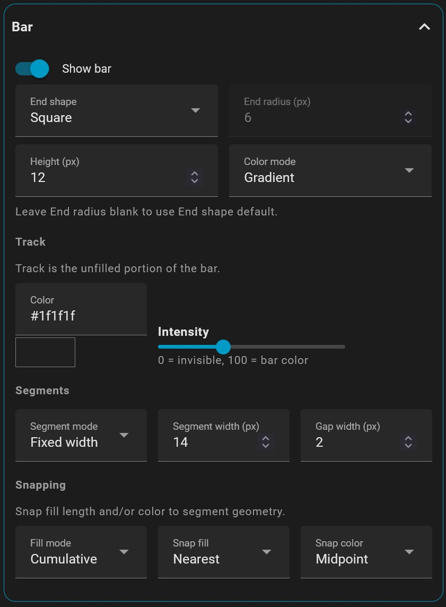
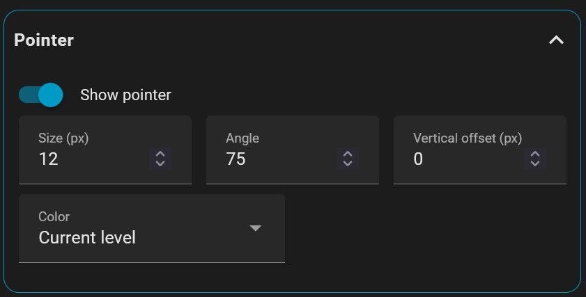
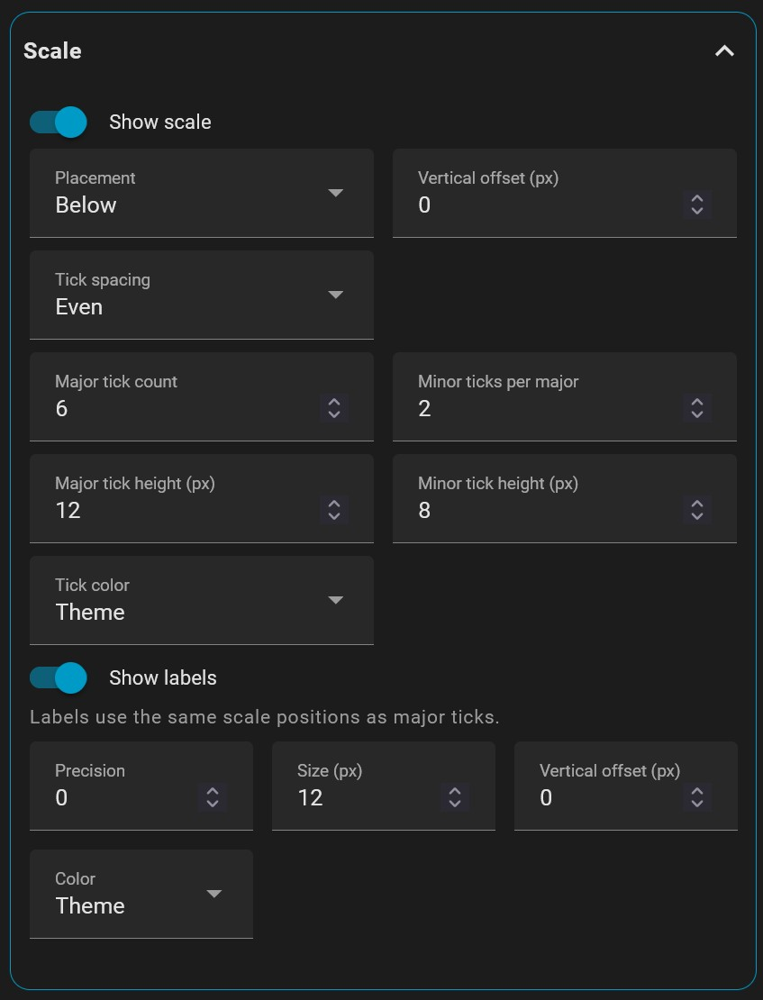
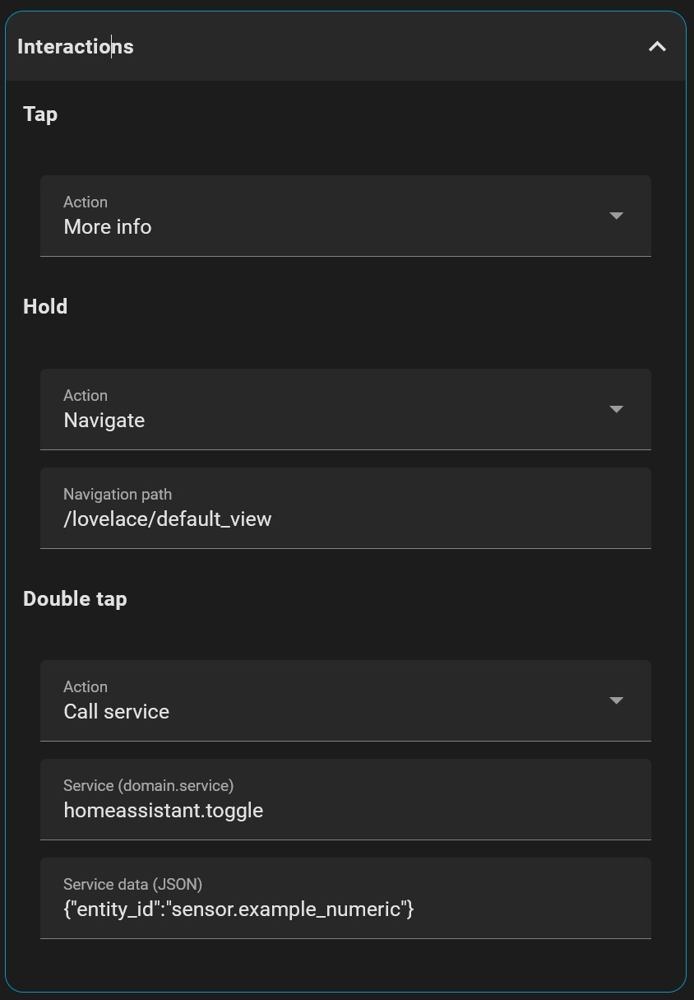

## Visual Editor Reference

This page maps each Segment Gauge editor section to its YAML fields.  
You can use it as a quick lookup while editing in the GUI. See the [configuration reference](configuration.md) for the complete field documentation.

<table width="100%">
<tr>
<th width="42%">GUI</th>
<th width="58%">YAML</th>
</tr>

<tr>
<td valign="top">

</td>

<td>

```yaml
type: custom:segment-gauge
entity: sensor.cabinet_temperature
content:
  name: Example Gauge
  show_icon: true
  show_name: true
  show_state: true
  icon: mdi:gauge
  icon_color:
    mode: theme
    value: "#03a9f4" # Ignored unless mode is custom.
style:
  card: default
  debug_layout: false
layout:
  mode: horizontal
  split_pct: 40
  gauge_alignment: center_labels
  content_spacing: 0
```
</td>
</tr>

<tr>
<td valign="top">

</td>

<td>

```yaml
data:
  min: 0
  max: 100
  precision: 1
  unit: "%"
levels:
  - value: 0
    color: "#ff0000"
    icon: mdi:alert
  - value: 50
    color: "#ffff00"
    icon: mdi:minus
  - value: 100
    color: "#00ff00"
    icon: mdi:check
```
</td>
</tr>

<tr>
<td valign="top">

</td>
<td>

```yaml
bar:
  show: true
  height: 12
  edge: rounded
  radius: 6 # Explicit override. If omitted, radius follows edge and height.
  color_mode: gradient
  fill_mode: cumulative
  track:
    background: "#1f1f1f"
    intensity: 35
  segments:
    mode: fixed
    width: 14
    gap: 2
    segments_per_level: 3 # Ignored in fixed segment mode.
  snapping:
    fill: nearest
    color: midpoint
```
</td>
</tr>


<tr>
<td valign="top">

</td>
<td>

```yaml
pointer:
  show: true
  size: 12
  angle: 75
  y_offset: 0
  color_mode: level
  color: "#ffffff" # Ignored unless color_mode is custom.
```
</td>
</tr>


<tr>
<td valign="top">

</td>
<td>

```yaml
scale:
  show: true
  placement: below
  y_offset: 0
  spacing: even
  ticks:
    color_mode: theme
    color: "#ffffff" # Ignored unless color_mode is custom.
    major_count: 6
    minor_per_major: 2
    height_major: 12
    height_minor: 8
  labels:
    show: true
    precision: 0
    size: 12
    y_offset: 0
    color_mode: theme
    color: "#ffffff" # Ignored unless color_mode is custom.
```
</td>
</tr>

<tr>
<td valign="top">

</td>
<td>

```yaml
actions:
  tap_action:
    action: more-info
  hold_action:
    action: navigate
    navigation_path: /lovelace/default_view
  double_tap_action:
    action: call-service
    service: homeassistant.toggle
    service_data:
      entity_id: sensor.example_numeric
```
</td>
</tr>
</table>
